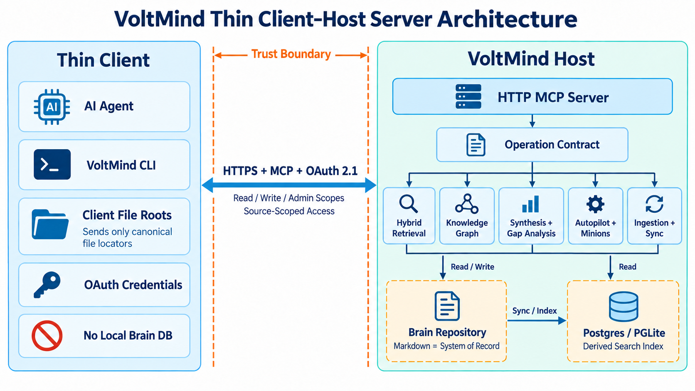
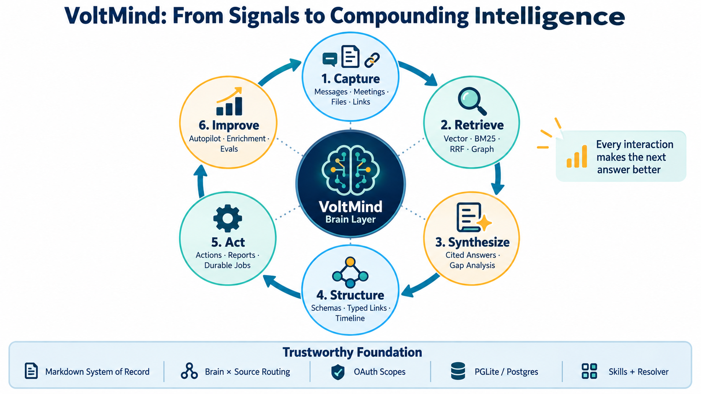

# VoltMind 项目展示汇报稿

> 适用场景：向 leader 做 8–12 分钟项目介绍，并配合 1–2 个现场演示。
>
> 当前代码版本：`0.42.0.0`（以 `package.json` 为准）。

## 一句话定位

**VoltMind 是面向 AI Agent 的长期知识脑与知识运行时：它把分散的 Markdown、会议、人物、项目和想法组织成可检索、可追溯、可推理、可持续更新的知识系统，让 Agent 不只“搜到资料”，而是给出带引用、带关系、带缺口分析的答案。**

如果只讲一句差异：

> Traditional RAG returns documents. VoltMind returns a cited answer, explains the relationships, and tells the agent what is still unknown.

## 先讲清楚它解决什么问题

普通 Agent 有三个典型问题：

1. **会话失忆**：上周讨论过的人、项目、承诺，下一次对话又要重新解释。
2. **检索不等于答案**：传统搜索或 RAG 返回一组页面、段落，仍然需要人自己阅读和拼接。
3. **知识不会自动变好**：新会议、新邮件、新想法没有进入统一结构，也没有形成关系、时间线和后续行动。

VoltMind 的目标不是再做一个笔记软件，而是在 Agent 与个人/团队知识之间增加一个长期运行的 brain layer：

```text
Raw information → Structured knowledge → Cited answer → Action → New evidence
       ↑                                                        ↓
       └────────────────── Compounding loop ────────────────────┘
```

## 建议的 10 分钟汇报结构

### 第 1 页：问题与定位（1 分钟）

讲法：

> 现在的 AI Agent 很聪明，但对我们的业务世界没有持续记忆。它可能能搜索到文档，却不知道一个人和项目的历史关系，也不知道哪些信息已经过期。VoltMind 把这些知识变成 Agent 可持续使用的长期脑。

强调三个词：

- **Persistent**：跨会话、跨 Agent、跨设备保留上下文。
- **Structured**：不只是文本块，还有实体、类型、关系、时间线、事实和观点。
- **Actionable**：最终输出是答案、风险、行动和知识缺口，而非文件列表。

### 第 2 页：用户看到的结果（1 分钟）

用 README 的会议准备场景：

用户问：

> What do I need to know before my meeting with Alice tomorrow?

普通知识库返回五个相关页面；VoltMind 应返回一个综合答案：Alice 的背景、最近一次沟通、尚未完成的承诺，以及“最近六周没有新信息”这一知识缺口。每个结论都可追溯到来源页面。

这一页要传达：**搜索是中间过程，答案才是产品。**

### 第 3 页：Thin Client–Host Server 架构（2 分钟）



讲图时从左到右：

1. Thin Client 只保留 AI Agent、VoltMind CLI、OAuth 凭据，以及本机文件根目录映射。
2. 客户端没有本地 brain DB；所有脑查询、embedding、索引和后台任务都在 Host 执行。
3. 客户端通过 HTTPS + MCP + OAuth 2.1 访问 Host，并受 `read`、`write`、`admin` scope 与 source scope 约束。
4. Host 的统一 operation contract 同时服务 CLI 与 MCP，避免两个接口出现行为漂移。
5. Host 提供混合检索、知识图谱、答案合成、后台 Autopilot、Minions 作业队列、摄取与同步。
6. Markdown brain repository 是知识的 system of record；Postgres/PGLite 是可重建的派生检索索引。

这套架构的价值：

- **一个事实源**：多个客户端共享同一 Host，避免每台机器维护一套脑和重复索引。
- **集中计算**：embedding、rerank、graph、后台任务集中运行，thin client 不需要数据库、Docker 或 Python。
- **最小权限**：OAuth scope、source scope 与 `localOnly` 操作边界共同限制远程 Agent。
- **本地文件隐私**：共享盘的盘符和用户名映射留在客户端；Host 只保存规范化 locator。

一句话总结：

> Thin client keeps interaction local; the Host centralizes knowledge, compute, and policy.

### 第 4 页：核心能力闭环（2 分钟）



按顺时针讲：

1. **Capture**：从消息、会议、文件、链接和 webhook 接收信号。
2. **Retrieve**：向量、BM25、RRF、知识图谱协同召回，而不是只靠 embedding。
3. **Synthesize**：跨页面生成带引用的答案，并明确数据陈旧、矛盾或缺失。
4. **Structure**：schema pack 定义页面类型、可抽取事实和 typed links，时间线表达变化。
5. **Act**：生成 action、report 或 durable job；Minions 让长任务具备持久状态、重试和恢复能力。
6. **Improve**：Autopilot 持续同步、抽取、嵌入、富化、矛盾检查和质量评估。

底座有五个可信机制：

- Markdown system of record
- Brain × Source 双轴路由
- OAuth 与 trust boundary
- PGLite / Postgres 双引擎
- Skills + Resolver 的动态工作流

### 第 5 页：为什么检索效果不同（1 分钟）

VoltMind 的检索是多层组合：

```text
Intent classification
  → optional query expansion
  → Vector + BM25
  → RRF fusion
  → source-aware and graph signals
  → cross-encoder reranking
  → token budget
  → page-level deduplication
```

四个关键解释：

- Vector 找语义近似。
- BM25 找人名、术语、代码标识符等精确字面信息。
- RRF 合并多个排序，不把系统押在单一分数上。
- Graph 沿 `works_at`、`invested_in`、`attended` 等 typed edge 找事实关系。

README 给出的 BrainBench 结果是 P@5 49.1%、R@5 97.9%，相对 graph-disabled 版本 P@5 提升约 31 个百分点。汇报时应说明这是项目自带基准和合成语料结果，不应包装为所有真实数据集上的普遍保证。

### 第 6 页：Skills + Resolver（1 分钟）

VoltMind 把能力分成两层：

- **Deterministic runtime**：适合数据库查询、权限校验、同步、索引、计数、作业状态等必须可靠复现的工作。
- **Fat skills**：用 Markdown 描述需要判断、适应和提问的工作流，例如会议摄取、实体富化、研究、日报、技能优化。

Resolver 是按用户意图加载正确 Skill 的路由表。这样 Agent 不需要每次把全部操作手册塞进上下文，只在任务触发时加载所需流程。

需要区分两个 Resolver：

1. `skills/RESOLVER.md` 是 **workflow router**：决定“这个请求应该执行哪套技能”。
2. `brain/RESOLVER.md` 是 **filing authority**：决定“产生的知识页面应该落到哪个目录”。

### 第 7 页：三个真实应用例子（2 分钟）

#### 例子 A：会前准备

用户触发语：

> “我明天要和 Alice 开会，告诉我需要知道什么。”

系统路径：

```text
skills/RESOLVER → query / meeting preparation
brain-first search → person + meetings + project + actions
graph traversal → relationships and commitments
synthesis → cited briefing + stale/missing-data warning
```

业务结果：把 20 分钟翻资料压缩成一段可执行的会前 briefing。

#### 例子 B：会议纪要进入脑并形成行动

用户触发语：

> “把这份会议纪要放进 brain，并整理后续动作。”

系统路径：

```text
skills/RESOLVER → meeting-ingestion
raw evidence → sources/
meeting analysis → meetings/
people and company updates → people/ + companies/
bounded deliverable → projects/ or artifacts/
executable follow-ups → state/actions/
citations + backlinks → sync/index
```

业务结果：同一份会议材料同时形成可追溯证据、实体更新、关系和行动，而不是只保存一个孤立文档。

#### 例子 C：捕获原创想法并逐步升级为项目

用户触发语：

> “记住这个想法：我们可以用客户支持对话反向生成产品需求地图。”

首次归档：尚无 owner、里程碑或执行范围，按 `brain/RESOLVER.md` 进入 `ideas/`。

当用户补充 owner、目标、里程碑和结束条件后，它从 idea 变成 bounded work unit，应创建 `projects/` 页面；具体报告进入 `artifacts/`，可执行步骤进入 `state/actions/`，长期无终点的责任域进入 `workstreams/`。

业务结果：知识结构跟随工作成熟度演化，避免把“想法、项目、产物、动作”混成一类 note。

## 基于 Resolver 的实际触发案例表

| 用户说法 | Workflow Resolver | Filing Resolver | 预期结果 |
|---|---|---|---|
| “我们对 X 知道什么？” | `query` | 不写入 | 先 keyword search，再按需 hybrid query / get page，返回带来源答案 |
| “A 和 B 有什么关系？” | `query` + graph query | 不写入 | 沿 typed edges 返回关系路径 |
| “保存这个想法” | `capture` / `idea-ingest` | `ideas/` 或 `originals/` | 保留原话、添加引用和实体反链 |
| “处理这份会议纪要” | `meeting-ingestion` | `sources/` + `meetings/` + entity pages | 原始证据与综合页面分离 |
| “把它变成一个长期追踪项目” | `project` | `projects/`；无终点则 `workstreams/` | 建立目标、owner、里程碑、来源绑定和状态 |
| “今天有什么要紧事？” | `briefing` | 默认只读；保存报告时进 `artifacts/` | 聚合行动、承诺、风险和会议准备 |
| “这个动作已经完成” | `daily-task-manager` / `schedule-actions` | `state/actions/` | 本地 Markdown 是 action 的权威状态 |
| “这不是我说的，修正它” | `correction-pipeline` | 修复原页面与证据链 | 不把错误继续当作事实传播 |
| “检查引用/事实是否可靠” | `citation-fixer` / `fact-check` | 修复对应 canonical page | 每个耐久事实保持可追溯来源 |
| “这个人属于哪个团队、和哪些项目相关？” | `query` / `find_experts` | 不写入 | 结合 person、org、project 与 typed links 回答 |

## 建议现场 Demo

### Demo 1：证明“搜索”和“思考”不同

```bash
voltmind search "<一个你们项目里的真实主题>"
voltmind think "<同一个问题>"
```

观察点：

- `search` 返回原始检索结果与匹配证据。
- `think` 输出综合答案、引用和 gap analysis。

### Demo 2：证明知识图谱能回答关系问题

```bash
voltmind graph-query "<一个真实人物或项目>"
```

或者直接向 Agent 问：

> “这个项目涉及哪些人、分别在哪些会议中出现、还有什么未完成承诺？”

观察点：语义相似只能找到“内容像”的页面；graph 可以找到“事实相连”的页面。

### Demo 3：证明闭环会积累

```bash
voltmind capture "<一条无敏感信息的演示想法>"
voltmind search "<刚才想法里的关键词>"
```

如果演示完整 ingest，可再展示页面落盘、引用、反链与同步后的检索结果。

现场演示建议：提前准备脱敏数据，避免临时依赖外部 embedding/rerank 服务；保留截图或录屏作为故障兜底。

## 项目的关键设计取舍

### 1. Markdown 是 system of record，数据库是派生索引

收益：

- 人可读、可 Git 审计、可 diff、可迁移。
- 数据库损坏时可以从 Markdown 重新同步和抽取。
- 多 Agent 写入最终通过文件与 Git 合并，而不是让数据库成为不可见的唯一真相。

需要诚实说明的边界：OAuth token、作业队列、请求日志等运行时基础设施状态本来就是 DB-only；它们不是用户知识。

### 2. Brain 与 Source 是两条正交轴

- **Brain**：选择哪个数据库，通常代表数据所有权和权限边界。
- **Source**：选择该数据库中的哪个内容仓库，通常代表同一所有者下的不同 repo/topic。

简单记忆：**owner 变了，切 brain；owner 不变但 repo 变了，切 source。**

跨 brain 不做数据库级透明 federation，而由 Agent 显式 fan-out、综合并引用 `brain:source:slug`，提高可调试性和审计性。

### 3. Contract-first 与双引擎一致性

`src/core/operations.ts` 是 CLI 与 MCP 的单一 operation contract。当前 checkout 中静态列出了 126 个 operation，涵盖页面、检索、关系、时间线、文件引用、作业、actions、facts/takes、schema 与诊断等能力。

`BrainEngine` 同时由 PGLite 和 Postgres 实现：

- PGLite：零配置，本地/个人场景；README 给出的建议规模是约 50K 页面以内。
- Postgres + pgvector：共享、大规模、多机器与 Host 场景。

### 4. Remote 默认不可信，边界 fail-closed

- 本地 CLI 明确标记为 trusted local caller。
- MCP/HTTP 远程调用明确标记为 untrusted。
- 安全敏感行为按 `remote !== false` 收紧；不能因为字段缺失就误判为本地可信。
- source isolation 通过统一的 scope helper 执行，避免某个读操作漏掉过滤。
- `localOnly` 操作不会暴露给远程 MCP。

## Leader 可能追问的问题

### “这不就是 RAG 吗？”

回答：RAG 是底层组件之一。VoltMind 在检索之上增加了 typed graph、时间线、schema、引用、答案合成、知识缺口、持续 ingest、后台维护和 action/job runtime。RAG 解决“相关文本在哪里”，VoltMind 解决“Agent 应该知道什么、相信什么、下一步做什么”。

### “为什么不用纯数据库做 system of record？”

回答：用户知识需要可读、可审计、可版本管理和可迁移。Markdown + Git 更适合作为 durable truth；数据库更适合做可重建的索引、向量、缓存和运行时状态。二者分工能降低锁定风险和灾难恢复成本。

### “Thin client 为什么重要？”

回答：它让多台电脑、多种 Agent 共享一个经过治理的脑，同时把数据库、embedding、后台任务和权限集中在 Host。客户端部署轻，数据与策略不会分叉。

### “数据会不会串库或越权？”

回答：Brain 是数据库边界，Source 是库内仓库边界；OAuth client 可以绑定 source 与 federated-read 范围。远程 operation 不读取服务端的本地 dotfile/env 路由，而使用授权上下文。关键安全判断 fail-closed，并且本地专属操作不会通过 HTTP 暴露。

### “知识错误了怎么办？”

回答：耐久事实要求来源引用；事实、观点、时间线和关系都能追溯到 Markdown。系统提供 correction、fact checking、contradiction detection、version/revert 与 forget 流程。Gap analysis 也会主动说明陈旧、未引用或缺失信息。

### “如何衡量效果？”

回答：

- 检索指标：P@k、R@k、MRR、nDCG。
- 真实工作流指标：会前准备时间、重复提问次数、行动遗漏率、知识新鲜度、答案引用覆盖率。
- 工程回归：LongMemEval、真实 query capture/replay、NamedThingBench、engine parity 和 trust-boundary tests。

### “项目最大的风险是什么？”

建议坦诚回答：

1. 输入质量决定知识质量，错误 ingest 会积累，所以 citation、correction 和 review gate 很关键。
2. 图谱覆盖依赖链接抽取和 schema 质量；新鲜页面在建立关系前可能仍较稀疏。
3. LLM synthesis 有成本与不确定性，需要 token budget、rerank/expansion 配置和 gap analysis 约束。
4. Skill 数量增长可能带来路由重叠，因此 Resolver、reachability 检查和 skill eval 是必要基础设施。

## 结尾 45 秒讲稿

> VoltMind 的核心不是把更多文档塞进向量库，而是为 Agent 建立一套长期、结构化、可追溯的认知基础设施。它用 Markdown 保证所有权和可恢复性，用 Postgres/PGLite 提供高效检索，用 graph 和 schema 表达关系，用 synthesis 把检索结果变成答案，再通过 Skills、Resolver、Autopilot 和 Minions 把知识变成持续运行的工作流。Thin client–Host 架构让这套能力可以安全地服务多个 Agent 和设备。最终目标是：每一次交互都让下一次回答更好。

## 汇报时建议强调的四个项目亮点

1. **从 retrieval 到 answer**：带引用的综合与 gap analysis 是产品层差异。
2. **从文档到关系**：typed graph + schema 支持人物、公司、项目、会议和承诺之间的结构化推理。
3. **从单次使用到复利闭环**：signal、write、auto-link、sync、autopilot 持续让脑变好。
4. **从单机工具到可信基础设施**：thin client、Host、OAuth/source scope、contract-first 与 system-of-record 共同支持团队化运行。

## 主要依据文件

- `README.md`：产品定位、用户场景、能力与安装路径。
- `AGENTS.md`、`CLAUDE.md`：运行协议、架构约束、trust boundary 与任务路由。
- `docs/architecture/thin-client.md`、`docs/architecture/topologies.md`：thin client–Host 拓扑。
- `docs/architecture/system-of-record.md`：Markdown canonical / DB derived contract。
- `docs/architecture/RETRIEVAL.md`：hybrid + graph 检索原理和基准。
- `docs/architecture/brains-and-sources.md`：Brain × Source 双轴模型。
- `docs/ethos/THIN_HARNESS_FAT_SKILLS.md`：thin harness、fat skills、resolver 的设计理念。
- `skills/RESOLVER.md`：Agent 工作流触发路由。
- `brain/RESOLVER.md`：知识页面和 state object 的归档规则。
- `src/core/operations.ts`、`src/core/engine.ts`：contract-first 与双引擎接口。
- `package.json`：当前版本、运行环境和验证脚本。
